# Databricks Concepts — Data Flow & Control Flow

This document explains the core Databricks concepts of **Data Flow** and **Control Flow**, how they map to this project, and how they complement dbt.

---

## Data Flow — How Data Moves Through the Lakehouse

Data flow describes the journey of data from raw ingestion to analytics-ready tables.

### Medallion Architecture

```mermaid
flowchart LR
    subgraph Sources["📥 Data Sources"]
        IOT["IoT Sensors<br/>(10 devices)"]
        CSV["Seed CSVs<br/>(raw_*.csv)"]
    end

    subgraph Bronze["🥉 BRONZE — Raw Ingestion"]
        direction TB
        STG1["stg_sensor_readings<br/><i>VIEW</i>"]
        STG2["stg_devices<br/><i>VIEW</i>"]
        STG3["stg_alerts<br/><i>VIEW</i>"]
    end

    subgraph Silver["🥈 SILVER — Cleaned & Enriched"]
        direction TB
        INT1["int_sensor_readings_cleaned<br/><i>INCREMENTAL</i><br/>dedup + anomaly flags"]
        INT2["int_device_health<br/><i>INCREMENTAL</i><br/>hourly aggregations"]
        INT3["int_alerts_enriched<br/><i>INCREMENTAL</i><br/>severity scoring"]
    end

    subgraph Gold["🥇 GOLD — Business Ready"]
        direction TB
        FCT1["fct_hourly_metrics<br/><i>TABLE</i>"]
        FCT2["fct_device_summary<br/><i>TABLE</i>"]
        FCT3["fct_anomaly_events<br/><i>TABLE</i>"]
        DIM1["dim_devices<br/><i>TABLE</i>"]
    end

    subgraph Consumers["📊 Consumers"]
        DASH["Dashboards"]
        ML["ML Models"]
        API["APIs"]
    end

    Sources --> Bronze
    Bronze --> Silver
    Silver --> Gold
    Gold --> Consumers

    style Sources fill:#6c757d,color:#fff
    style Bronze fill:#cd7f32,color:#fff
    style Silver fill:#c0c0c0,color:#000
    style Gold fill:#ffd700,color:#000
    style Consumers fill:#198754,color:#fff
```

### Delta Lake Features at Each Layer

| Layer | Format | Key Delta Features Used |
|-------|--------|------------------------|
| **Bronze** | Views over Delta seeds | Type casting, column standardization |
| **Silver** | Delta (Incremental) | MERGE operations, deduplication, schema evolution (`append_new_columns`) |
| **Gold** | Delta (Table) | OPTIMIZE, ZORDER, time travel for audit |

### Data Flow Concepts Demonstrated

```mermaid
flowchart TD
    subgraph DeltaFeatures["Delta Lake Data Flow Features"]
        A["📝 Transaction Log<br/><code>DESCRIBE HISTORY</code>"] --> B["⏰ Time Travel<br/><code>VERSION AS OF</code>"]
        B --> C["📐 Schema Evolution<br/><code>on_schema_change</code>"]
        C --> D["🔄 Incremental Processing<br/><code>MERGE INTO</code>"]
        D --> E["📊 Optimization<br/><code>OPTIMIZE + ZORDER</code>"]
        E --> F["🧹 Storage Management<br/><code>VACUUM</code>"]
    end

    style A fill:#4ecdc4,color:#fff
    style B fill:#45b7d1,color:#fff
    style C fill:#96ceb4,color:#fff
    style D fill:#ffeaa7,color:#000
    style E fill:#dfe6e9,color:#000
    style F fill:#fab1a0,color:#000
```

| Concept | What It Does | SQL Command |
|---------|--------------|-------------|
| **Transaction Log** | Records every change to a table | `DESCRIBE HISTORY table` |
| **Time Travel** | Query data at a previous point in time | `SELECT * FROM table VERSION AS OF 3` |
| **Schema Evolution** | Add columns without breaking queries | `on_schema_change='append_new_columns'` |
| **Incremental Load** | Process only new/changed rows | `MERGE INTO target USING source` |
| **OPTIMIZE** | Compact small files for faster reads | `OPTIMIZE table ZORDER BY (col)` |
| **VACUUM** | Clean up old files to save storage | `VACUUM table RETAIN 168 HOURS` |

---

## Control Flow — How Tasks Are Orchestrated

Control flow describes the execution order, branching, and error handling of pipeline tasks.

### Databricks Workflow — dbt Pipeline

```mermaid
flowchart LR
    SEED["🌱 dbt seed<br/><i>Load CSVs</i>"]
    RUN_BS["🔨 dbt run<br/><i>Bronze + Silver</i>"]
    TEST["✅ dbt test<br/><i>Silver quality</i>"]
    RUN_G["🏆 dbt run<br/><i>Gold</i>"]
    DOCS["📄 dbt docs<br/><i>Generate</i>"]
    NOTIFY["📧 Notify<br/><i>Team</i>"]

    SEED --> RUN_BS --> TEST --> RUN_G --> DOCS --> NOTIFY

    style SEED fill:#6c757d,color:#fff
    style RUN_BS fill:#cd7f32,color:#fff
    style TEST fill:#28a745,color:#fff
    style RUN_G fill:#ffd700,color:#000
    style DOCS fill:#17a2b8,color:#fff
    style NOTIFY fill:#6f42c1,color:#fff
```

### Conditional Execution (IF/ELSE)

```mermaid
flowchart TD
    CHECK["🔍 Check Anomaly Count<br/><i>SQL Task</i>"]
    COND{"Anomalies > 50?"}
    FULL["🔄 Full Refresh Gold<br/><code>dbt run --full-refresh</code>"]
    INCR["⚡ Incremental Gold<br/><code>dbt run</code>"]
    DONE["✅ Complete"]

    CHECK --> COND
    COND -->|"YES (high anomalies)"| FULL
    COND -->|"NO (normal)"| INCR
    FULL --> DONE
    INCR --> DONE

    style CHECK fill:#4ecdc4,color:#fff
    style COND fill:#ffeaa7,color:#000
    style FULL fill:#e74c3c,color:#fff
    style INCR fill:#2ecc71,color:#fff
    style DONE fill:#95a5a6,color:#fff
```

### ForEach Task (Loop)

```mermaid
flowchart TD
    GET["📋 Get Plant Locations<br/><i>Returns: Detroit, Chicago, Austin</i>"]
    
    subgraph ForEach["🔁 ForEach Plant (parallel)"]
        P1["🏭 Detroit<br/>Health Check"]
        P2["🏭 Chicago<br/>Health Check"]
        P3["🏭 Austin<br/>Health Check"]
    end
    
    AGG["📊 Aggregate Results"]

    GET --> ForEach
    ForEach --> AGG

    style GET fill:#3498db,color:#fff
    style ForEach fill:#ecf0f1,color:#000
    style P1 fill:#e67e22,color:#fff
    style P2 fill:#e67e22,color:#fff
    style P3 fill:#e67e22,color:#fff
    style AGG fill:#2ecc71,color:#fff
```

### Error Handling & Retries

```mermaid
flowchart TD
    RUN["▶️ Run Task"]
    FAIL{"Failed?"}
    RETRY{"Retries<br/>remaining?"}
    WAIT["⏱️ Wait 30s"]
    SUCCESS["✅ Success"]
    ALERT["🚨 Alert Team<br/><i>Email / Slack</i>"]

    RUN --> FAIL
    FAIL -->|No| SUCCESS
    FAIL -->|Yes| RETRY
    RETRY -->|"Yes (max 3)"| WAIT
    WAIT --> RUN
    RETRY -->|No| ALERT

    style RUN fill:#3498db,color:#fff
    style SUCCESS fill:#2ecc71,color:#fff
    style ALERT fill:#e74c3c,color:#fff
    style WAIT fill:#f39c12,color:#fff
```

### Control Flow Features Summary

| Feature | Description | Use Case |
|---------|-------------|----------|
| **Task Dependencies** | `depends_on` creates a DAG | Sequential pipeline stages |
| **Conditional (IF/ELSE)** | Branch based on query results | Full refresh vs incremental |
| **ForEach** | Iterate over a list | Per-plant, per-device analysis |
| **Retries** | Auto-retry on failure (1-3x) | Transient network/compute errors |
| **Timeouts** | Kill long-running tasks | SLA enforcement |
| **Parameters** | Pass values between tasks | Environment, thresholds |
| **Notifications** | Email/Slack on events | Alerting on failures |

---

## dbt + Databricks Integration — Complete Picture

```mermaid
sequenceDiagram
    participant Sched as ⏰ Scheduler (Cron)
    participant WF as 🎛️ Databricks Workflow
    participant SQL as 🖥️ SQL Warehouse
    participant dbt as 🔧 dbt
    participant Delta as 💾 Delta Lake
    participant UC as 📦 Unity Catalog

    Sched->>WF: Trigger job (daily 6 AM)
    
    WF->>dbt: Task 1: dbt seed
    dbt->>SQL: CREATE TABLE (seeds)
    SQL->>Delta: Write Parquet + Transaction Log
    Delta-->>UC: Register in catalog
    
    WF->>dbt: Task 2: dbt run (Bronze + Silver)
    dbt->>SQL: CREATE VIEW (Bronze)
    dbt->>SQL: MERGE INTO (Silver - Incremental)
    SQL->>Delta: Write Parquet + Transaction Log
    
    WF->>dbt: Task 3: dbt test
    dbt->>SQL: Run 54 test queries
    SQL-->>dbt: All passed ✅
    
    WF->>dbt: Task 4: dbt run (Gold)
    dbt->>SQL: CREATE TABLE (Gold)
    SQL->>Delta: Write Parquet + Transaction Log
    Delta-->>UC: Update lineage graph
    
    WF-->>Sched: Job complete ✅
```

---

## When to Use What — Decision Guide

### Comparison Matrix

| Dimension | dbt | Delta Live Tables (DLT) | Databricks Workflows |
|-----------|-----|-------------------------|----------------------|
| **Primary role** | SQL transformations | Data pipeline definition | Task orchestration |
| **Execution** | Batch (run → done) | Streaming or batch | Scheduled or triggered |
| **Data quality** | Tests (54 in this project) | Expectations | Depends on task type |
| **Documentation** | Auto-generated DAG + docs | Pipeline graph | Job run history |
| **Version control** | ✅ Git-native SQL files | ⚠️ Notebooks in Repos | ⚠️ JSON job definitions |
| **Portability** | ✅ Multi-platform | ❌ Databricks only | ❌ Databricks only |
| **Best for** | Complex transforms, testing | Real-time ingestion | Orchestrating everything |

### The Production Stack

| Layer | Tool | Role |
|-------|------|------|
| **Ingestion** | Auto Loader + DLT | Stream files into Bronze Delta tables |
| **Transformation** | dbt | Clean, enrich, aggregate (Bronze → Silver → Gold) |
| **Orchestration** | Databricks Workflows | Schedule, branch, retry, notify |
| **Governance** | Unity Catalog | Access control, lineage, audit |
| **Compute** | SQL Warehouse (Serverless) | Execute all SQL workloads |

---

## Notebooks in This Project

| Notebook | Type | Content |
|----------|------|---------|
| [`iot_eda_analysis.sql`](notebooks/iot_eda_analysis.sql) | SQL | Exploratory data analysis on Gold layer |
| [`databricks_data_flow.sql`](notebooks/databricks_data_flow.sql) | SQL | Delta Lake deep dive — time travel, schema evolution, optimization |
| [`databricks_control_flow.py`](notebooks/databricks_control_flow.py) | Python | Workflow definitions — multi-task, conditional, ForEach, error handling |
