# dbt + Databricks Setup Guide

A comprehensive step-by-step guide for installing dbt and integrating with Databricks using the Medallion Architecture.

---

## Architecture Overview


---

## Data Flow (Medallion Architecture)

```mermaid
flowchart TD
    A["📥 Seeds<br/>(raw_sensor_readings, raw_devices, raw_alerts)"] --> B["🔄 BRONZE — Staging<br/>(stg_sensor_readings, stg_devices, stg_alerts)"]
    B --> C["⚙️ SILVER — Intermediate<br/>(int_sensor_readings_cleaned, int_device_health, int_alerts_enriched)"]
    C --> D["📊 GOLD — Marts<br/>(fct_hourly_metrics, fct_device_summary, fct_anomaly_events, dim_devices)"]
    
    style A fill:#6c757d,color:#fff
    style B fill:#cd7f32,color:#fff
    style C fill:#c0c0c0,color:#000
    style D fill:#ffd700,color:#000
```


---

## Step 1: Create Databricks Account

### 1.1 Sign Up
1. Go to [databricks.com/try-databricks](https://www.databricks.com/try-databricks)
2. Choose **your cloud provider** (AWS, Azure, or GCP)
3. Complete registration — you'll get a **14-day free trial**
4. Alternatively, use **Community Edition** (free forever, limited features)

### 1.2 Get Workspace Details
After login, note your workspace URL from the browser address bar:

| Field | Example | Description |
|-------|---------|-------------|
| Workspace URL | `dbc-xxxxx-xxx.cloud.databricks.com` | Used as `host` in profiles.yml |
| Catalog | `workspace` | Unity Catalog name (default) |

---

## Step 2: Set Up Databricks Objects

### 2.1 Create a SQL Warehouse
1. In Databricks sidebar, click **SQL Warehouses**
2. Click **Create SQL Warehouse**
3. Name it (e.g., `Starter Warehouse`)
4. Select **Serverless** type, Size **2X-Small**
5. Click **Create**

### 2.2 Get Connection Details
Navigate to your SQL Warehouse → **Connection details** tab:

| Field | Example | Description |
|-------|---------|-------------|
| Server Hostname | `dbc-xxxxx-xxx.cloud.databricks.com` | Same as workspace URL |
| HTTP Path | `/sql/1.0/warehouses/abc123def456` | Unique warehouse path |
| Port | `443` | Always 443 |

### 2.3 Generate Personal Access Token (PAT)
1. Click your **profile icon** (top-right) → **Settings**
2. Go to **Developer** → **Access tokens** → **Manage**
3. Click **Generate new token**
4. Set comment: `dbt-databricks`, lifetime: `90 days`
5. Click **Generate** and **copy the token** (shown only once!)

### Databricks Object Hierarchy

```mermaid
flowchart TD
    WH["🖥️ SQL Warehouse<br/>(Serverless)"]
    CAT["📦 workspace<br/>(Unity Catalog)"]
    RAW["📁 iot_dev_raw<br/>(Seeds Schema)"]
    BRZ["📁 iot_dev_bronze<br/>(Staging Schema)"]
    SLV["📁 iot_dev_silver<br/>(Intermediate Schema)"]
    GLD["📁 iot_dev_gold<br/>(Marts Schema)"]
    
    WH --> CAT
    CAT --> RAW
    CAT --> BRZ
    CAT --> SLV
    CAT --> GLD
```


---

## Step 3: Install dbt

### 3.1 Create Python Virtual Environment
```bash
# Navigate to project directory
cd /path/to/your/project

# Create virtual environment
python3 -m venv dbt-venv

# Activate it
source dbt-venv/bin/activate  # Mac/Linux
# dbt-venv\Scripts\activate   # Windows
```

### 3.2 Install dbt-databricks
```bash
# Upgrade pip
pip install --upgrade pip

# Install dbt with Databricks adapter
pip install dbt-databricks

# Verify installation
dbt --version
```

Expected output:
```
Core:
  - installed: 1.10.x

Plugins:
  - databricks: 1.10.x
```

---

## Step 4: Configure dbt Profile

### 4.1 Create profiles.yml
```bash
mkdir -p ~/.dbt
```

Add this content to `~/.dbt/profiles.yml` (replace with your credentials):

```yaml
iot_databricks:
  target: dev
  outputs:
    dev:
      type: databricks
      host: "YOUR_WORKSPACE_URL"           # e.g., dbc-xxxxx-xxx.cloud.databricks.com
      http_path: "YOUR_HTTP_PATH"          # e.g., /sql/1.0/warehouses/abc123def456
      token: "YOUR_PAT_TOKEN"             # e.g., dapi53c891df...
      catalog: "workspace"                 # Your Unity Catalog name
      schema: "iot_dev"                    # Default schema
      threads: 4
```

### 4.2 Profile Configuration Diagram


---

## Step 5: Project Structure

### 5.1 Directory Layout
```
iot-dbt-databricks/
├── dbt_project.yml                 # Project config + anomaly thresholds
├── packages.yml                    # dbt_utils dependency
├── profiles.yml.template           # Connection template (Git-safe)
├── .gitignore
├── .github/workflows/dbt_ci.yml    # CI pipeline
│
├── seeds/                          # Simulated IoT data
│   ├── raw_sensor_readings.csv     # 209 sensor readings
│   ├── raw_devices.csv             # 10 factory devices
│   ├── raw_alerts.csv              # 24 alert events
│   └── schema.yml
│
├── models/
│   ├── overview.md                 # dbt docs homepage
│   ├── staging/       ← BRONZE
│   │   ├── sources.yml             # Source definitions + freshness
│   │   ├── stg_sensor_readings.sql
│   │   ├── stg_devices.sql
│   │   ├── stg_alerts.sql
│   │   └── schema.yml
│   ├── intermediate/  ← SILVER
│   │   ├── int_sensor_readings_cleaned.sql
│   │   ├── int_device_health.sql
│   │   ├── int_alerts_enriched.sql
│   │   └── schema.yml
│   └── marts/         ← GOLD
│       ├── fct_hourly_metrics.sql
│       ├── fct_device_summary.sql
│       ├── fct_anomaly_events.sql
│       ├── dim_devices.sql
│       └── schema.yml
│
├── macros/
│   ├── generate_schema_name.sql    # Medallion schema routing
│   └── test_value_in_range.sql     # Custom generic test
│
├── tests/
│   └── assert_no_orphan_alerts.sql # Singular test
│
└── notebooks/
    └── iot_eda_analysis.sql        # Databricks SQL notebook
```

### 5.2 dbt_project.yml (Key Sections)
```yaml
name: 'iot_databricks'
version: '1.0.0'
profile: 'iot_databricks'

vars:
  temperature_upper: 85.0    # Anomaly thresholds
  vibration_upper: 9.0

models:
  iot_databricks:
    staging:
      +materialized: view       # Bronze = Views
      +schema: bronze
    intermediate:
      +materialized: incremental # Silver = Incremental
      +schema: silver
    marts:
      +materialized: table       # Gold = Tables
      +schema: gold
```

### 5.3 Example: Bronze Model (stg_sensor_readings.sql)
```sql
with source as (
    select * from {{ source('iot_raw', 'raw_sensor_readings') }}
),
renamed as (
    select
        reading_id,
        device_id,
        lower(trim(metric_name))       as metric_name,
        cast(metric_value as double)   as metric_value,
        cast(reading_ts as timestamp)  as reading_ts,
        current_timestamp()            as _dbt_loaded_at
    from source
)
select * from renamed
```

### 5.4 Example: Silver Model (int_sensor_readings_cleaned.sql)
```sql
{{ config(materialized='incremental', unique_key='reading_id') }}

with deduplicated as (
    select *, row_number() over (
        partition by reading_id order by ingested_at desc
    ) as _row_num
    from {{ ref('stg_sensor_readings') }}
    
        where ingested_at > (select max(ingested_at) from {{ this }})
    
)
select *, 
    case when metric_value > {{ var('temperature_upper') }} 
         then true else false end as is_anomaly
from deduplicated where _row_num = 1
```

> **Note:** `{{ ref() }}` creates dependencies between models. `{{ var() }}` uses configurable thresholds.

---

## Step 6: Run dbt

### 6.1 Install Packages
```bash
dbt deps
```

### 6.2 Verify Connection
```bash
dbt debug
```

Expected output:
```
Connection test: [OK connection ok]
All checks passed!
```

### 6.3 Load Seed Data
```bash
dbt seed
```

Expected output:
```
Completed successfully
Done. PASS=3 WARN=0 ERROR=0 SKIP=0 TOTAL=3
```

### 6.4 Build Models
```bash
dbt run
```

Expected output:
```
1 of 10 OK created sql view model iot_dev_bronze.stg_alerts
2 of 10 OK created sql view model iot_dev_bronze.stg_devices
3 of 10 OK created sql view model iot_dev_bronze.stg_sensor_readings
4 of 10 OK created sql incremental model iot_dev_silver.int_alerts_enriched
5 of 10 OK created sql incremental model iot_dev_silver.int_sensor_readings_cleaned
...
Done. PASS=10 WARN=0 ERROR=0 SKIP=0 TOTAL=10
```

### 6.5 Run Tests
```bash
dbt test
```

Expected output:
```
Completed successfully
Done. PASS=54 WARN=0 ERROR=0 SKIP=0 TOTAL=54
```

### 6.6 dbt Execution Flow


---

## Step 7: Generate Documentation
```bash
# Generate docs
dbt docs generate

# Serve locally (opens browser)
dbt docs serve --port 8080
```

This creates an interactive documentation site showing:
- Model descriptions
- Column definitions
- **Data lineage graph (DAG)** — Bronze → Silver → Gold
- Test results
- Source freshness status

---

## Step 8: Run the EDA Notebook (Optional)

1. In Databricks, click **Workspace** → **Import**
2. Upload `notebooks/iot_eda_analysis.sql`
3. Attach to your SQL Warehouse
4. Run all cells — explores Gold layer tables with 7 analytical queries

---

## Quick Reference Commands

| Command | Description |
|---------|-------------|
| `dbt debug` | Test connection to Databricks |
| `dbt deps` | Install packages (dbt_utils) |
| `dbt seed` | Load CSV seed data |
| `dbt run` | Build all models |
| `dbt run --select stg_sensor_readings` | Build specific model |
| `dbt run --select tag:silver` | Build all Silver models |
| `dbt test` | Run all 54 tests |
| `dbt docs generate` | Generate documentation |
| `dbt docs serve` | View docs in browser |
| `dbt source freshness` | Check source data freshness |
| `dbt clean` | Remove compiled files |

---

## Troubleshooting

### Connection Errors

| Error | Solution |
|-------|----------|
| `UC_HIVE_METASTORE_DISABLED_EXCEPTION` | Change `catalog` to `workspace` (or your Unity Catalog name) in profiles.yml |
| `INVALID_PARAMETER_VALUE: Invalid access token` | Regenerate PAT token in Settings → Developer → Access tokens |
| `RESOURCE_DOES_NOT_EXIST: SQL warehouse not found` | Verify `http_path` matches your SQL Warehouse connection details |
| `CAST_INVALID_INPUT` on seed | Check CSV data for misaligned columns or bad data types |
| `Could not find profile named` | Ensure `profile:` in dbt_project.yml matches the key in profiles.yml |

### Common Issues


---

## Key Databricks Concepts

| Concept | Description |
|---------|-------------|
| **Unity Catalog** | Centralized governance with 3-level namespace: `catalog.schema.table` |
| **Delta Lake** | Storage format with ACID transactions, time travel, and schema evolution |
| **SQL Warehouse** | Serverless compute for SQL workloads (what dbt connects to) |
| **Medallion Architecture** | Bronze (raw) → Silver (cleaned) → Gold (analytics-ready) |
| **Photon Engine** | Optimized query engine powering SQL Warehouses |
| **Liquid Clustering** | Next-gen data layout optimization (replaces partitioning) |
| **Databricks Workflows** | Job orchestration for scheduling dbt runs |
| **Auto Loader** | Incrementally ingests new files (production replacement for seeds) |
